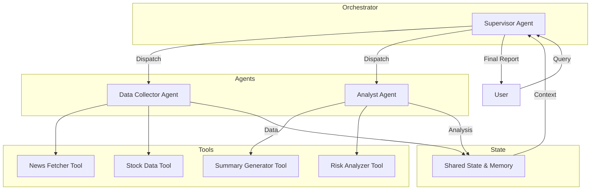

# 🏢 Company Intelligence Agent

A Multi-Agent System built with **LangGraph** that generates comprehensive market summaries for companies by orchestrating specialized AI agents.

## 🎯 Overview

This project demonstrates a multi-agent architecture where two collaborating agents work together to produce company intelligence reports:

| Agent | Role | Tools |
|-------|------|-------|
| **Data Collector** | Fetches company news and stock data | `news_fetcher`, `stock_data` |
| **Analyst** | Analyzes data and generates insights | `summary_generator`, `risk_analyzer` |

A **Supervisor/Orchestrator** coordinates these agents using LangGraph's `StateGraph`, maintaining shared state and memory throughout the workflow.

## 🏗️ Architecture



### Workflow

```
┌─────────────────┐     ┌──────────────────┐     ┌───────────────────┐
│ Data Collector  │ ──► │    Analyst       │ ──► │ Report Generator  │
│                 │     │                  │     │                   │
│ • Fetch news    │     │ • Analyze data   │     │ • Combine results │
│ • Get stock data│     │ • Identify risks │     │ • Format report   │
└─────────────────┘     └──────────────────┘     └───────────────────┘
         │                       │                        │
         └───────────────────────┴────────────────────────┘
                                 │
                    ┌────────────▼────────────┐
                    │      Shared State       │
                    │ (company, news, stock,  │
                    │  analysis, risks, etc.) │
                    └─────────────────────────┘
```

## 📁 Project Structure

```
company-intelligence-agent/
├── src/
│   ├── agents/
│   │   ├── data_collector.py  # Agent 1: Fetches news & stock data
│   │   └── analyst.py         # Agent 2: Analyzes & generates insights
│   ├── tools/
│   │   ├── news_fetcher.py    # Tool to fetch company news
│   │   ├── stock_data.py      # Tool to get stock performance
│   │   ├── summary_generator.py # Tool to generate summaries
│   │   └── risk_analyzer.py   # Tool to analyze risks
│   ├── orchestrator/
│   │   └── supervisor.py      # LangGraph workflow orchestrator
│   ├── state/
│   │   └── shared_state.py    # Shared state definition
│   └── main.py                # CLI entry point
├── ui/
│   └── streamlit_app.py       # Streamlit web interface
├── notebooks/
│   └── multi_agent_demo.ipynb # Jupyter notebook demo
├── requirements.txt
├── .env.example
└── README.md
```

## 🚀 Quick Start

### Prerequisites

- Python 3.9+
- OpenAI API key (optional - works with simulated data without it)

### Installation

1. **Clone the repository**
   ```bash
   git clone https://github.com/yourusername/company-intelligence-agent.git
   cd company-intelligence-agent
   ```

2. **Create a virtual environment**
   ```bash
   python -m venv venv
   
   # Windows
   .\venv\Scripts\activate
   
   # macOS/Linux
   source venv/bin/activate
   ```

3. **Install dependencies**
   ```bash
   pip install -r requirements.txt
   ```

4. **Set up environment variables**
   ```bash
   # Copy the example env file
   cp .env.example .env
   
   # Edit .env and add your OpenAI API key
   OPENAI_API_KEY=your_api_key_here
   ```

### Usage

#### Command Line Interface

```bash
# Basic usage
python -m src.main --company "Apple"

# With custom thread ID for session memory
python -m src.main --company "Microsoft" --thread-id "session1"

# Verbose mode
python -m src.main --company "Tesla" --verbose
```

#### Streamlit Web UI

```bash
streamlit run ui/streamlit_app.py
```

Then open your browser to `http://localhost:8501`

#### Jupyter Notebook

```bash
jupyter notebook notebooks/multi_agent_demo.ipynb
```

## 📊 Features

### Multi-Agent Coordination
- **LangGraph StateGraph**: Orchestrates agent workflow with conditional routing
- **Shared State**: Context maintained across all agent interactions
- **Memory Persistence**: Session memory via LangGraph's checkpointer

### Data Collection
- **News Fetcher**: Retrieves recent news with sentiment analysis (simulated)
- **Stock Data**: Real stock data via `yfinance` with simulated fallback

### Analysis
- **Market Summary**: Comprehensive analysis of news and stock performance
- **Risk Assessment**: Categorized risk factors with severity levels

### User Interface
- **CLI**: Command-line interface with argument parsing
- **Streamlit UI**: Modern web interface with:
  - Real-time progress indicators
  - Interactive tabs for different sections
  - Metrics cards for stock data
  - Downloadable reports

## 🔧 Configuration

### Environment Variables

| Variable | Required | Description |
|----------|----------|-------------|
| `OPENAI_API_KEY` | Optional* | OpenAI API key for LLM-based agents |
| `NEWS_API_KEY` | Optional | NewsAPI key (if using real news data) |

*The system works without an API key using simulated data and direct tool calls.

### Customization

- Modify agent prompts in `src/agents/data_collector.py` and `src/agents/analyst.py`
- Add new tools in `src/tools/`
- Extend the workflow in `src/orchestrator/supervisor.py`

## 🧪 Testing

```bash
# Run unit tests
python -m pytest tests/ -v

# Run integration tests
python -m pytest tests/test_integration.py -v
```

## 📝 Example Output

```
============================================================
🚀 Starting Company Intelligence Analysis: Apple
============================================================

📊 [Data Collector] Gathering data for Apple...
   ✓ Collected 5 news articles
   ✓ Retrieved stock performance data

🔍 [Analyst] Analyzing data for Apple...
   ✓ Generated market analysis
   ✓ Identified 4 risk factors
   ✓ Risk Level: MODERATE

📝 [Report Generator] Creating final report for Apple...
   ✓ Report generated successfully

============================================================
COMPANY INTELLIGENCE REPORT: APPLE
============================================================

## 📈 Stock Performance
Stock Performance Summary:
- Current Price: $178.50 USD
- Daily Change: +1.25% (up)
- Monthly Change: +5.67% (up)
...
```

## 🤝 Contributing

1. Fork the repository
2. Create a feature branch (`git checkout -b feature/amazing-feature`)
3. Commit your changes (`git commit -m 'Add amazing feature'`)
4. Push to the branch (`git push origin feature/amazing-feature`)
5. Open a Pull Request

## 📄 License

This project is licensed under the MIT License - see the [LICENSE](LICENSE) file for details.

## 🙏 Acknowledgments

- [LangChain](https://github.com/langchain-ai/langchain) - LLM application framework
- [LangGraph](https://github.com/langchain-ai/langgraph) - Multi-agent orchestration
- [Streamlit](https://streamlit.io/) - Web UI framework
- [yfinance](https://github.com/ranaroussi/yfinance) - Stock data API

---

⚠️ **Disclaimer**: This system is for educational and demonstration purposes only. The generated reports should not be considered financial advice. Always conduct your own research and consult with qualified financial professionals before making investment decisions.
